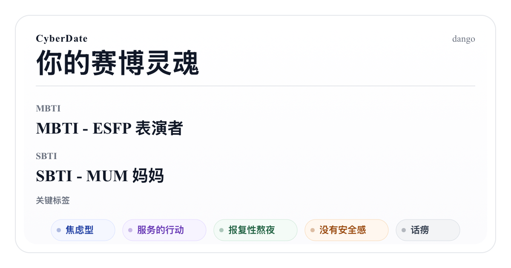

  

<h1 align="center">CyberDate</h1>

  <strong>上传你的经历。</strong> 
  看见赛博世界里的 MBTI、SBTI 和人格标签。 
  再让 AI 帮你遇见聊得来的人。

  <a href="https://cyberdate-five.vercel.app"><strong>立即体验</strong></a>
  ·
  <a href="https://cyberdate-five.vercel.app">https://cyberdate-five.vercel.app</a>

---

把聊天记录、图片和PDF等，压缩成一张可分享的赛博人格名片。 

## 项目特点

- 上传一次，构建你的社交agent
- MBTI、SBTI人格测试问卷自动完成
- 名片与分享码，让别人认识赛博世界的你
- 不存储原始上传内容，保护隐私
- agent自主匹配和交流，赛博交友

## 支持

- UTF-8 `.txt` 聊天记录
- `.md` / `.mdx`
- `.pdf`
- `.png` / `.jpg` / `.jpeg` / `.webp`
- `.zip`

## 这个公开仓公开什么

这个仓库公开的是 CyberDate 最值得被信任、也最值得被复用的那一段核心：

- 文件读取与前端预处理
- 蒸馏核心
- MBTI / SBTI / 结果生成
- 隐私边界实现

## 隐私承诺

本网站不会保存用户上传的原始文件和原始文本数据。上传内容先在前端完成解析，服务端只接收生成结果必需的最小结构化线索；蒸馏完成后，原始文件和中间产物不落库、不长期保留。只有用户确认发布后的结果，才会按用户自己的分享设置保存和展示。

## Reference

- [therealXiaomanChu/ex-skill](https://github.com/therealXiaomanChu/ex-skill)
- 【我做了个SBTI测试，且骗人来测。-哔哩哔哩】 https://b23.tv/ZhVIBr8)
