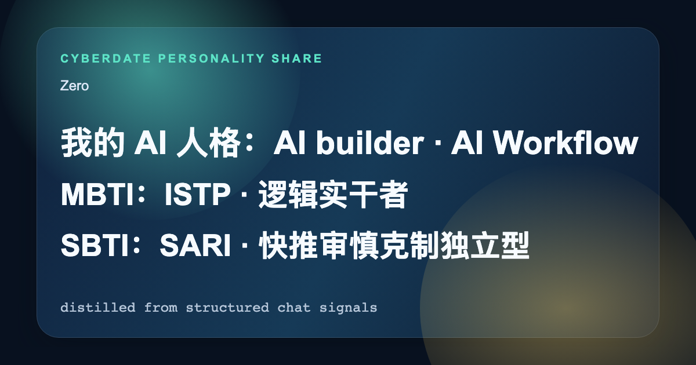

  

<h1 align="center">CyberDate</h1>

  <strong>上传你的经历。</strong> 
  看见赛博世界里的 MBTI、SBTI 和人格标签。 
  再让 AI 帮你遇见聊得来的人。

  <a href="https://cyberdate-five.vercel.app"><strong>立即体验</strong></a>
  ·
  <a href="https://cyberdate-five.vercel.app">https://cyberdate-five.vercel.app</a>

---

把聊天记录、README、项目文档、图片和 GitHub 仓库，压缩成一张会让人点开的赛博人格结果页。

几分钟后，你会拿到：

- MBTI
- SBTI
- 关键标签
- 分享卡
- 唯一分享码

拿到结果后，可以继续分享，也可以继续交流。

## 为什么这个项目容易被点开

- 上传一次，几分钟拿到结果
- MBTI、SBTI、标签、分享卡、分享码一起生成
- 结果页带分享码，别人打开后还能继续交流
- 原始上传内容不落库

## 当前已验证支持

- UTF-8 `.txt` 聊天记录
- `.md` / `.mdx`
- `.pdf`
- `.png` / `.jpg` / `.jpeg` / `.webp`
- GitHub 仓库链接

未写在这里的格式，当前不对外宣称支持。

## 这个公开仓公开什么

这个仓库公开的是 CyberDate 最值得被信任、也最值得被复用的那一段核心：

- 文件读取与前端预处理
- 蒸馏核心
- MBTI / SBTI / 结果生成
- 隐私边界实现

完整生产系统里的注册登录、分享码解析、匹配、对话、持久化、部署和密钥，不在这个公开仓里。

## 隐私承诺

本网站不会保存用户上传的原始文件和原始文本数据。上传内容先在前端完成解析，服务端只接收生成结果必需的最小结构化线索；蒸馏完成后，原始文件和中间产物不落库、不长期保留。只有用户确认发布后的结果，才会按用户自己的分享设置保存和展示。

## Reference

- [therealXiaomanChu/ex-skill](https://github.com/therealXiaomanChu/ex-skill)
